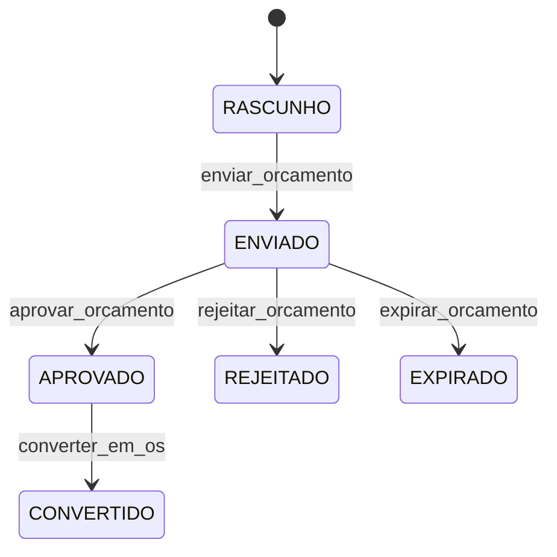
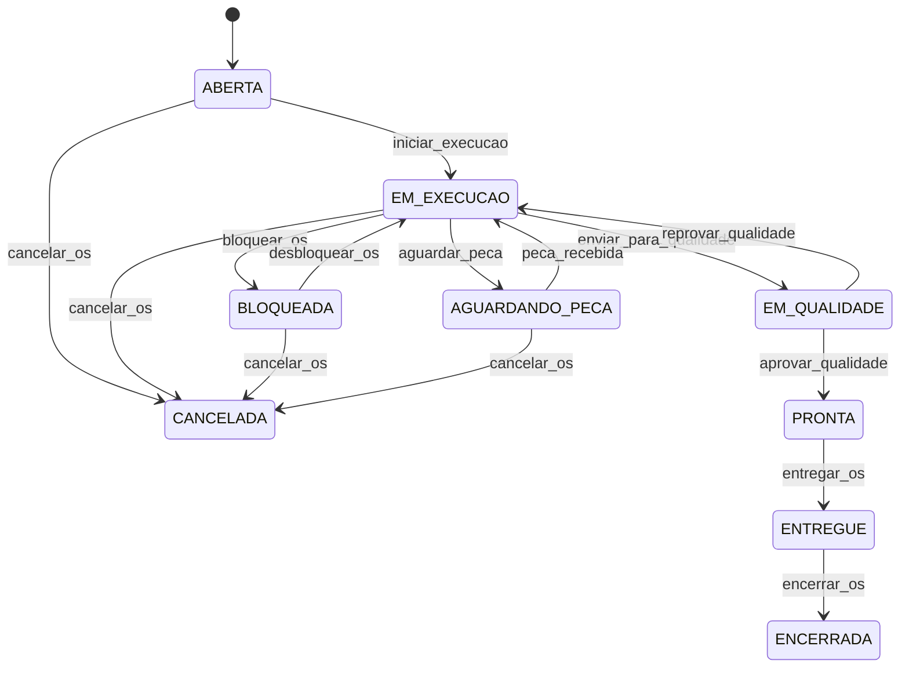
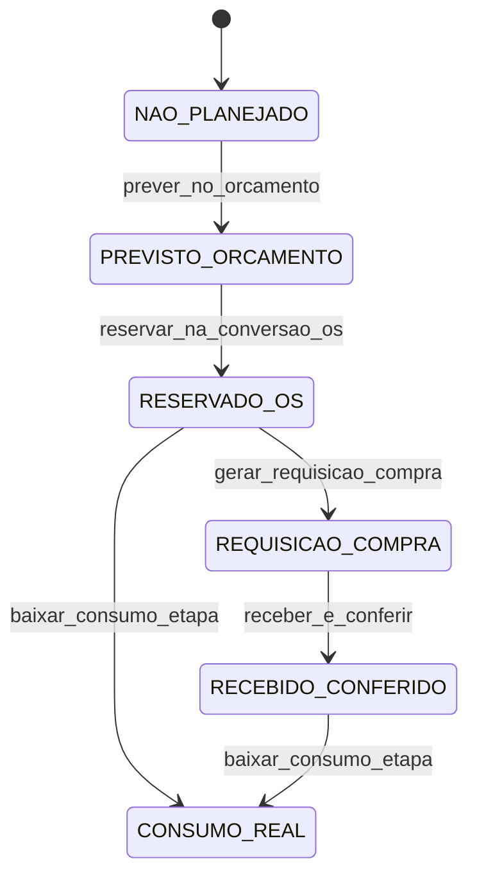

# Diagrama de estados e regras de transição

## 1) Orçamento

### Matriz de transições de Orçamento

| De | Para | Evento disparador | Perfis autorizados | Pré-condições | Pós-condições | Side effects |
|---|---|---|---|---|---|---|
| RASCUNHO | ENVIADO | `enviar_orcamento` | atendimento, vendedor, admin | itens e valores válidos; cliente vinculado | status atualizado; registro de histórico | notificar cliente; atualizar portal |
| ENVIADO | APROVADO | `aprovar_orcamento` | cliente, atendimento, admin | orçamento vigente; sem bloqueio comercial | status atualizado; registro de auditoria | notificar equipe interna; atualizar portal |
| ENVIADO | REJEITADO | `rejeitar_orcamento` | cliente, atendimento, admin | orçamento vigente | status atualizado; registro de motivo | notificar responsável comercial; atualizar portal |
| ENVIADO | EXPIRADO | `expirar_orcamento` | sistema, admin | data de validade atingida | status atualizado; auditoria automática | notificar atendimento; atualizar portal |
| APROVADO | CONVERTIDO | `converter_em_os` | atendimento, planejador, admin | orçamento aprovado | OS criada e vinculada; auditoria de conversão | notificar operação; atualizar portal |

## 2) Ordem de Serviço (OS)

### Matriz de transições de OS

| De | Para | Evento disparador | Perfis autorizados | Pré-condições | Pós-condições | Side effects |
|---|---|---|---|---|---|---|
| ABERTA | EM_EXECUCAO | `iniciar_execucao` | tecnico, supervisor, admin | orçamento vinculado aprovado; recursos alocados | status atualizado; histórico de início | notificar cliente (opcional); atualizar portal |
| ABERTA | CANCELADA | `cancelar_os` | supervisor, admin | sem execução iniciada | status atualizado; motivo registrado | notificar cliente; atualizar portal |
| EM_EXECUCAO | BLOQUEADA | `bloquear_os` | tecnico, supervisor, admin | bloqueio justificado | status atualizado; pendência registrada | notificar operação; atualizar portal |
| EM_EXECUCAO | AGUARDANDO_PECA | `aguardar_peca` | tecnico, compras, supervisor, admin | peça pendente identificada | status atualizado; item pendente registrado | notificar compras e cliente; atualizar portal |
| EM_EXECUCAO | EM_QUALIDADE | `enviar_para_qualidade` | tecnico, supervisor, admin | checklist técnico concluído | status atualizado; histórico de envio | notificar qualidade; atualizar portal |
| EM_EXECUCAO | CANCELADA | `cancelar_os` | supervisor, admin | justificativa aprovada | status atualizado; auditoria de cancelamento | notificar cliente; atualizar portal |
| BLOQUEADA | EM_EXECUCAO | `desbloquear_os` | supervisor, admin | impedimento removido | status atualizado; registro de desbloqueio | notificar time técnico; atualizar portal |
| BLOQUEADA | CANCELADA | `cancelar_os` | supervisor, admin | justificativa aprovada | status atualizado; auditoria de cancelamento | notificar cliente; atualizar portal |
| AGUARDANDO_PECA | EM_EXECUCAO | `peca_recebida` | compras, supervisor, admin | peça recebida em estoque | status atualizado; vínculo com recebimento | notificar técnico; atualizar portal |
| AGUARDANDO_PECA | CANCELADA | `cancelar_os` | supervisor, admin | justificativa aprovada | status atualizado; auditoria de cancelamento | notificar cliente; atualizar portal |
| EM_QUALIDADE | PRONTA | `aprovar_qualidade` | qualidade, supervisor, admin | inspeção aprovada | status atualizado; laudo anexado | notificar atendimento; atualizar portal |
| EM_QUALIDADE | EM_EXECUCAO | `reprovar_qualidade` | qualidade, supervisor, admin | inspeção reprovada | status atualizado; não conformidade registrada | notificar técnico; atualizar portal |
| PRONTA | ENTREGUE | `entregar_os` | atendimento, supervisor, admin | agendamento de entrega confirmado | status atualizado; comprovante registrado | notificar cliente; atualizar portal |
| ENTREGUE | ENCERRADA | `encerrar_os` | atendimento, financeiro, admin | documentação e faturamento concluídos | status atualizado; encerramento auditado | atualizar portal; disparar pesquisa de satisfação |

## 3) Estratégia de validação central no backend

- Criar um componente único de domínio (ex.: `TransitionValidator`) para validar **toda** alteração de status.
- API não altera estado diretamente: ela chama o validador com `(entidade, estado_atual, estado_destino, evento, perfil, contexto)`.
- O validador bloqueia transições inválidas quando:
  - par `(estado_atual, estado_destino)` não existe na matriz;
  - evento não corresponde à transição esperada;
  - perfil não autorizado;
  - pré-condição não satisfeita.
- Em caso de sucesso:
  - aplica mudança de status;
  - executa pós-condições;
  - registra auditoria/histórico;
  - dispara side effects de notificação e atualização de portal.

Esse padrão centraliza regra de negócio e evita inconsistências entre diferentes endpoints da API.

## 4) Ciclo de vida de item vinculado à OS

### Matriz de transições de item OS

| De | Para | Evento disparador | Perfis autorizados | Pré-condições | Pós-condições |
|---|---|---|---|---|---|
| NAO_PLANEJADO | PREVISTO_ORCAMENTO | `prever_no_orcamento` | planejador, orcamentista, admin | item e quantidade definidos | item previsto no orçamento |
| PREVISTO_ORCAMENTO | RESERVADO_OS | `reservar_na_conversao_os` | planejador, estoque, admin | vínculo de `os_id` obrigatório (ou exceção auditada) | quantidade reservada para a OS |
| RESERVADO_OS | REQUISICAO_COMPRA | `gerar_requisicao_compra` | compras, estoque, admin | saldo insuficiente com `purchase_request_id` gerado | requisição de compra formalizada |
| REQUISICAO_COMPRA | RECEBIDO_CONFERIDO | `receber_e_conferir` | almoxarife, compras, qualidade, admin | recebimento físico com conferência aprovada | lote apto para consumo |
| RESERVADO_OS / RECEBIDO_CONFERIDO | CONSUMO_REAL | `baixar_consumo_etapa` | tecnico, supervisor, admin | vínculo de `os_id` obrigatório (ou exceção auditada) | baixa real por etapa (`step_id`) |

### Regras de consistência obrigatórias

- Consumo sem vínculo de OS deve ser bloqueado por padrão.
- Exceção só é permitida com `allow_unlinked_consumption=true` e `exception_audit_id` obrigatório.
- Toda baixa real grava apontamento por etapa para permitir rastreio do consumo técnico.

### Reconciliação periódica (saldo físico x sistema x consumo)

- Job periódico deve comparar:
  - `physical_balance` (contagem física),
  - `system_balance` (saldo no ERP),
  - `consumed_total` (somatório de baixas por etapa).
- Fórmula de validação usada no domínio: `expected_system_balance = physical_balance - consumed_total`.
- Divergência acima da tolerância gera falha de reconciliação e abertura de tratativa operacional.
