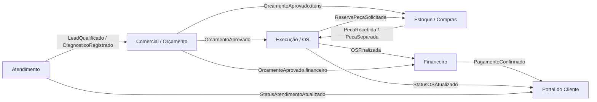

# Mapeamento de Contextos e Contratos de Integração

## 1) Diagrama de Contexto (alto nível)



> Convenção: cada contexto é dono dos seus dados transacionais e publica eventos de negócio para consumidores.

---

## 2) Entidades proprietárias por contexto

| Contexto | Entidades proprietárias (aggregate roots) | Papel que pode criar | Papel que pode editar | Observações de governança |
|---|---|---|---|---|
| Atendimento | `Cliente`, `Veiculo`, `Atendimento`, `DiagnosticoInicial`, `AnexoAtendimento` | Atendente | Atendente, Supervisor de atendimento | Comercial e Execução apenas referenciam IDs e snapshot mínimo do cliente/veículo. |
| Comercial / Orçamento | `Orcamento`, `ItemOrcamento`, `CondicaoComercial`, `ValidadeOrcamento`, `AprovacaoOrcamento` | Consultor comercial | Consultor comercial, Gestor comercial | Após aprovação, orçamento fica bloqueado para edição estrutural (itens/valores). |
| Execução / OS | `OrdemServico`, `EtapaOS`, `ApontamentoTecnico`, `ChecklistExecucao`, `ConsumoPecaOS` | Planejador/Coordenador técnico | Técnico responsável, Coordenador técnico | Não altera preço de venda; só executa escopo aprovado. |
| Estoque / Compras | `Produto`, `SaldoEstoque`, `MovimentoEstoque`, `PedidoCompra`, `Recebimento` | Almoxarife / Comprador | Almoxarife, Comprador, Gestor de suprimentos | Quantidades físicas e custo médio são exclusivos deste contexto. |
| Financeiro | `TituloReceber`, `TituloPagar`, `Fatura`, `Pagamento`, `BaixaFinanceira` | Financeiro | Financeiro, Controller | Status de liquidação e conciliação são fontes oficiais para portal e comercial. |
| Portal do Cliente | `ContaPortal`, `PreferenciaNotificacao`, `VisualizacaoDocumento`, `AceiteDigital` | Cliente (self-service) / Suporte portal | Cliente (dados de perfil), Suporte portal | Portal não é dono de orçamento/OS/fatura; atua como projeção de leitura + interações de aceite. |

---

## 3) Eventos de integração entre contextos

| Evento (domínio) | Publicador (owner) | Consumidores | Gatilho | Payload mínimo (contrato) |
|---|---|---|---|---|
| `LeadQualificado` | Atendimento | Comercial | Atendimento classificado como oportunidade | `atendimentoId`, `clienteId`, `veiculoId`, `sintomaResumo`, `prioridade`, `timestamp` |
| `DiagnosticoRegistrado` | Atendimento | Comercial, Execução | Diagnóstico inicial concluído | `atendimentoId`, `diagnosticoId`, `itensSugeridos[]`, `observacoes`, `timestamp` |
| `OrcamentoCriado` | Comercial | Portal, Atendimento | Primeira versão do orçamento gerada | `orcamentoId`, `atendimentoId`, `versao`, `valorTotal`, `validadeAte`, `timestamp` |
| `OrcamentoAprovado` | Comercial | Execução, Estoque/Compras, Financeiro, Portal | Aprovação do cliente | `orcamentoId`, `versaoAprovada`, `clienteId`, `veiculoId`, `itensAprovados[]`, `valorAprovado`, `condicaoPagamento`, `timestamp` |
| `OrcamentoReprovado` | Comercial | Atendimento, Portal | Reprovação pelo cliente | `orcamentoId`, `motivo`, `timestamp` |
| `OSGerada` | Execução | Portal, Financeiro, Estoque/Compras | Conversão de orçamento aprovado em OS | `osId`, `orcamentoId`, `dataPrevistaConclusao`, `responsavelTecnicoId`, `timestamp` |
| `ReservaPecaSolicitada` | Execução | Estoque/Compras | Necessidade de material para OS | `osId`, `itens[] {produtoId, quantidade}`, `prioridade`, `timestamp` |
| `PecaSeparada` | Estoque/Compras | Execução | Material reservado fisicamente | `reservaId`, `osId`, `itens[]`, `localizacao`, `timestamp` |
| `PecaRecebida` | Estoque/Compras | Execução, Financeiro | Recebimento de compra | `recebimentoId`, `pedidoCompraId`, `itens[]`, `valorRecebido`, `timestamp` |
| `OSIniciada` | Execução | Portal | Primeira etapa iniciada | `osId`, `dataInicio`, `timestamp` |
| `StatusOSAtualizado` | Execução | Portal, Atendimento | Mudança de etapa/status | `osId`, `statusAnterior`, `statusAtual`, `percentualConclusao`, `timestamp` |
| `OSFinalizada` | Execução | Financeiro, Portal, Atendimento | Encerramento técnico | `osId`, `dataFim`, `laudoFinal`, `itensExecutados[]`, `timestamp` |
| `FaturaEmitida` | Financeiro | Portal, Comercial | Geração de cobrança | `faturaId`, `osId|orcamentoId`, `valor`, `vencimento`, `linhaDigitavel`, `timestamp` |
| `PagamentoConfirmado` | Financeiro | Portal, Comercial, Atendimento | Liquidação confirmada | `pagamentoId`, `faturaId`, `valorPago`, `dataPagamento`, `timestamp` |

---

## 4) Campos somente leitura em módulos consumidores

### Atendimento (consome dados de outros)
- De `Comercial`: `orcamento.valorTotal`, `orcamento.status`, `orcamento.validadeAte`.
- De `Execução`: `os.status`, `os.previsaoConclusao`, `os.laudoFinal`.
- De `Financeiro`: `fatura.statusPagamento`, `fatura.valorEmAberto`.

### Comercial / Orçamento (consome)
- De `Atendimento`: `cliente.documento`, `veiculo.chassi`, `diagnosticoInicial`.
- De `Estoque`: `produto.saldoDisponivel`, `produto.custoMedio` (somente para sugestão de margem, sem alteração).
- De `Financeiro`: `limiteCreditoCliente`, `historicoInadimplencia`.

### Execução / OS (consome)
- De `Comercial`: `orcamento.itensAprovados`, `orcamento.precoVenda`, `orcamento.descontosAprovados`.
- De `Atendimento`: `sintomaRelatado`, `historicoAtendimento`.
- De `Estoque`: `saldoDisponivel`, `statusReserva`, `dataPrevistaReposicao`.

### Estoque / Compras (consome)
- De `Execução`: `os.prioridade`, `os.dataPrevistaConclusao`, `consumoPrevisto`.
- De `Comercial`: `demandaPrevista` derivada de orçamentos aprovados.

### Financeiro (consome)
- De `Comercial`: `orcamento.valorAprovado`, `condicaoPagamento`, `clienteResponsavelFinanceiro`.
- De `Execução`: `os.dataFinalizacao`, `itensExecutados`, `horasTecnicas`.

### Portal do Cliente (consome)
- De `Atendimento`: `protocoloAtendimento`, `statusAtendimento`.
- De `Comercial`: `orcamentoPdfUrl`, `statusAprovacao`, `validadeAte`.
- De `Execução`: `statusOS`, `etapaAtual`, `previsaoEntrega`.
- De `Financeiro`: `faturas[]`, `statusPagamento`, `comprovanteUrl`.

> Regra geral: módulo consumidor nunca atualiza campo mestre de outro contexto; qualquer alteração deve ocorrer via comando/API do contexto dono.

---

## 5) Matriz de responsabilidade por regra de negócio

| Regra de negócio | Contexto responsável (fonte da verdade) | Pode validar localmente? | Pode decidir/finalizar regra? | Anti-duplicidade (como evitar lógica repetida) |
|---|---|---|---|---|
| Elegibilidade de atendimento (dados mínimos para abrir caso) | Atendimento | Outros podem pré-validar UI | Somente Atendimento | Expor endpoint `POST /atendimentos/validacoes` reutilizável. |
| Cálculo de preço, desconto máximo e margem | Comercial | Execução pode exibir snapshot | Somente Comercial | Serviço de pricing central e versão de política comercial. |
| Conversão de orçamento aprovado em OS | Execução | Comercial só dispara evento | Somente Execução | Handler único para `OrcamentoAprovado`. |
| Reserva, baixa e reposição de estoque | Estoque/Compras | Execução valida disponibilidade | Somente Estoque/Compras | API única de movimentos (`/movimentos-estoque`). |
| Critério de finalização técnica da OS | Execução | Portal/Atendimento só consultam | Somente Execução | Máquina de estados da OS em um único domínio. |
| Emissão de título/fatura e cálculo de juros/multa | Financeiro | Comercial pode simular | Somente Financeiro | Motor financeiro central com tabela de encargos versionada. |
| Estado de pagamento (aberto, parcial, liquidado) | Financeiro | Portal exibe | Somente Financeiro | Consumidores leem projeções/eventos de pagamento. |
| Publicação de status para cliente final | Portal (apresentação) + contexto origem (conteúdo) | Sim | Portal decide canal; origem decide conteúdo | Contrato de evento padrão `Status*Atualizado`. |

---

## 6) Tabela de contratos de API/Eventos (proposta)

| Tipo | Nome do contrato | Dono | Consumidor(es) | Operação/Canal | Campos obrigatórios | SLA/Consistência |
|---|---|---|---|---|---|---|
| API comando | `CriarAtendimento` | Atendimento | Front/Portal interno | `POST /atendimentos` | `clienteId`, `veiculoId`, `sintoma`, `canalOrigem` | Síncrono, resposta imediata |
| API consulta | `ConsultarOrcamento` | Comercial | Atendimento, Portal, Execução | `GET /orcamentos/{id}` | `id` | Síncrono, leitura autorizada |
| Evento | `OrcamentoAprovado.v1` | Comercial | Execução, Estoque, Financeiro, Portal | Broker (topic `comercial.orcamento-aprovado`) | `eventId`, `occurredAt`, `orcamentoId`, `versao`, `itensAprovados`, `valorAprovado` | Assíncrono, pelo menos uma vez, idempotência por `eventId` |
| API comando | `GerarOS` | Execução | Comercial (orquestração) | `POST /ordens-servico` | `orcamentoId`, `responsavelTecnicoId` | Síncrono + publica `OSGerada` |
| Evento | `OSGerada.v1` | Execução | Portal, Estoque, Financeiro | Broker (topic `execucao.os-gerada`) | `eventId`, `osId`, `orcamentoId`, `dataPrevistaConclusao` | Assíncrono, reprocessável |
| Evento | `PecaRecebida.v1` | Estoque/Compras | Execução, Financeiro | Broker (topic `estoque.peca-recebida`) | `eventId`, `recebimentoId`, `itens`, `valorRecebido` | Assíncrono, ordenação por `pedidoCompraId` |
| Evento | `OSFinalizada.v1` | Execução | Financeiro, Portal, Atendimento | Broker (topic `execucao.os-finalizada`) | `eventId`, `osId`, `dataFim`, `itensExecutados` | Assíncrono, gatilho para faturamento |
| API comando | `EmitirFatura` | Financeiro | Execução (trigger), Backoffice | `POST /faturas` | `referenciaTipo`, `referenciaId`, `valor`, `vencimento` | Síncrono |
| Evento | `PagamentoConfirmado.v1` | Financeiro | Portal, Comercial, Atendimento | Broker (topic `financeiro.pagamento-confirmado`) | `eventId`, `faturaId`, `valorPago`, `dataPagamento` | Assíncrono, eventual consistency |

### Campos transversais obrigatórios em eventos
- `eventId` (UUID), `eventType`, `eventVersion`, `occurredAt` (UTC ISO-8601), `producer`, `correlationId`, `tenantId` (quando multiempresa).

### Diretriz de evolução de contratos
- Quebra de contrato: publicar nova versão (`*.v2`) sem remover `v1` até migração completa.
- Campos novos: sempre opcionais por default na mesma versão.
- Consumidores devem ser tolerantes a campos desconhecidos.


---

## 7) Matriz de autorização (Perfil × Ação × Recurso × Escopo)

### 7.1 Perfis considerados
- **Atendente**
- **Consultor comercial**
- **Técnico**
- **Almoxarife/Comprador**
- **Financeiro**
- **Gerente de unidade**
- **Controller/Administrador global**

### 7.2 Convenções
- Ações: `criar`, `aprovar`, `editar_valor`, `cancelar`, `estornar`, `visualizar`.
- Recursos: `orcamento`, `os`, `compra`, `lancamento_financeiro`, `foto`.
- Escopos:
  - **proprio**: somente registros criados/atribuídos ao próprio usuário.
  - **unidade**: qualquer registro da mesma unidade do usuário.
  - **global**: qualquer unidade (multi-filial).
- Notação da matriz:
  - ✅ permitido
  - 🔒 negado
  - ⚠️ permitido com regra ABAC complementar

### 7.3 Matriz consolidada

| Perfil \ Recurso/Ação | criar | aprovar | editar_valor | cancelar | estornar | visualizar |
|---|---:|---:|---:|---:|---:|---:|
| **Atendente → orçamento** | ✅ (proprio) | 🔒 | 🔒 | 🔒 | 🔒 | ✅ (unidade) |
| **Atendente → OS** | 🔒 | 🔒 | 🔒 | 🔒 | 🔒 | ✅ (unidade) |
| **Atendente → compra** | 🔒 | 🔒 | 🔒 | 🔒 | 🔒 | ✅ (unidade) |
| **Atendente → lançamento financeiro** | 🔒 | 🔒 | 🔒 | 🔒 | 🔒 | ✅ (proprio/unidade restrito) |
| **Atendente → foto** | ✅ (proprio) | n/a | 🔒 | ✅ (proprio, antes de vincular) | 🔒 | ✅ (unidade) |
| **Consultor comercial → orçamento** | ✅ (proprio/unidade) | ⚠️ (unidade) | ⚠️ (proprio/unidade) | ⚠️ (proprio/unidade) | 🔒 | ✅ (unidade) |
| **Consultor comercial → OS** | 🔒 | 🔒 | 🔒 | 🔒 | 🔒 | ✅ (unidade) |
| **Consultor comercial → compra** | 🔒 | 🔒 | 🔒 | 🔒 | 🔒 | ✅ (unidade) |
| **Consultor comercial → lançamento financeiro** | 🔒 | 🔒 | 🔒 | 🔒 | 🔒 | ✅ (unidade, leitura comercial) |
| **Consultor comercial → foto** | ✅ (proprio/unidade) | n/a | 🔒 | ✅ (proprio) | 🔒 | ✅ (unidade) |
| **Técnico → orçamento** | 🔒 | 🔒 | 🔒 | 🔒 | 🔒 | ✅ (proprio/unidade) |
| **Técnico → OS** | ✅ (proprio atribuído) | ⚠️ (proprio atribuído) | 🔒 | ⚠️ (proprio atribuído) | 🔒 | ✅ (proprio/unidade) |
| **Técnico → compra** | 🔒 | 🔒 | 🔒 | 🔒 | 🔒 | ✅ (proprio/unidade) |
| **Técnico → lançamento financeiro** | 🔒 | 🔒 | 🔒 | 🔒 | 🔒 | 🔒 |
| **Técnico → foto** | ✅ (proprio/OS atribuída) | n/a | 🔒 | ✅ (proprio) | 🔒 | ✅ (proprio/unidade) |
| **Almoxarife/Comprador → orçamento** | 🔒 | 🔒 | 🔒 | 🔒 | 🔒 | ✅ (unidade) |
| **Almoxarife/Comprador → OS** | 🔒 | 🔒 | 🔒 | 🔒 | 🔒 | ✅ (unidade) |
| **Almoxarife/Comprador → compra** | ✅ (unidade) | ⚠️ (unidade) | ⚠️ (unidade) | ⚠️ (unidade) | 🔒 | ✅ (unidade) |
| **Almoxarife/Comprador → lançamento financeiro** | 🔒 | 🔒 | 🔒 | 🔒 | 🔒 | ✅ (unidade, somente títulos de compra) |
| **Almoxarife/Comprador → foto** | ✅ (unidade) | n/a | 🔒 | ✅ (proprio) | 🔒 | ✅ (unidade) |
| **Financeiro → orçamento** | 🔒 | 🔒 | 🔒 | 🔒 | 🔒 | ✅ (unidade/global) |
| **Financeiro → OS** | 🔒 | 🔒 | 🔒 | 🔒 | 🔒 | ✅ (unidade/global) |
| **Financeiro → compra** | 🔒 | 🔒 | 🔒 | 🔒 | 🔒 | ✅ (unidade/global) |
| **Financeiro → lançamento financeiro** | ✅ (unidade) | ⚠️ (unidade/global) | ⚠️ (unidade/global) | ⚠️ (unidade/global) | ⚠️ (unidade/global) | ✅ (unidade/global) |
| **Financeiro → foto** | 🔒 | n/a | 🔒 | 🔒 | 🔒 | ✅ (unidade/global) |
| **Gerente de unidade → orçamento** | ✅ (unidade) | ✅ (unidade) | ✅ (unidade) | ✅ (unidade) | 🔒 | ✅ (unidade) |
| **Gerente de unidade → OS** | ✅ (unidade) | ✅ (unidade) | 🔒 | ✅ (unidade) | 🔒 | ✅ (unidade) |
| **Gerente de unidade → compra** | ✅ (unidade) | ✅ (unidade) | ✅ (unidade) | ✅ (unidade) | 🔒 | ✅ (unidade) |
| **Gerente de unidade → lançamento financeiro** | ✅ (unidade) | ✅ (unidade) | ✅ (unidade) | ✅ (unidade) | ✅ (unidade, com justificativa) | ✅ (unidade) |
| **Gerente de unidade → foto** | ✅ (unidade) | n/a | 🔒 | ✅ (unidade) | 🔒 | ✅ (unidade) |
| **Controller/Administrador global → orçamento** | ✅ (global) | ✅ (global) | ✅ (global) | ✅ (global) | ✅ (global, exceção) | ✅ (global) |
| **Controller/Administrador global → OS** | ✅ (global) | ✅ (global) | 🔒 | ✅ (global) | ✅ (global, exceção) | ✅ (global) |
| **Controller/Administrador global → compra** | ✅ (global) | ✅ (global) | ✅ (global) | ✅ (global) | ✅ (global, exceção) | ✅ (global) |
| **Controller/Administrador global → lançamento financeiro** | ✅ (global) | ✅ (global) | ✅ (global) | ✅ (global) | ✅ (global) | ✅ (global) |
| **Controller/Administrador global → foto** | ✅ (global) | n/a | 🔒 | ✅ (global) | 🔒 | ✅ (global) |

> `n/a` = ação não aplicável ao recurso.

### 7.4 Regras ABAC complementares (policy conditions)

Aplicar as regras abaixo após o RBAC/perfil básico (modelo híbrido RBAC + ABAC):

1. **Aprovação por alçada de valor (orçamento/compra/lançamento financeiro)**
   - Se `valor <= limite_aprovacao_usuario`: permite aprovação por perfil habilitado.
   - Se `valor > limite_aprovacao_usuario`: exige perfil **Gerente de unidade** ou superior.
   - Se `valor > limite_aprovacao_gerente`: exige **Controller/Administrador global**.

2. **Edição de valor após aprovação**
   - Permitida somente se `status in {RASCUNHO, EM_REVISAO}`.
   - Se `status = APROVADO`, só pode com `motivo_reabertura` + nova trilha de aprovação.

3. **Cancelamento/estorno fora da janela operacional**
   - Se `now - created_at > janela_cancelamento_horas` => somente gerente ou controller.
   - Estorno financeiro exige sempre `justificativa` e `referencia_lancamento_origem`.

4. **Restrição por vínculo do registro**
   - Escopo `proprio` só libera quando `owner_id == user_id` ou `responsavel_id == user_id`.
   - Escopo `unidade` só libera quando `registro.unidade_id in user.unidades_permitidas`.

5. **Separação de funções (SoD)**
   - Usuário que **criou** não pode **aprovar** o mesmo `orcamento`, `compra` ou `lancamento_financeiro`, salvo exceção explícita de emergência auditada.

6. **Bloqueio por status final**
   - Registros em `CANCELADO`, `ESTORNADO` ou `FECHADO` são apenas leitura; alterações só via operação administrativa excepcional.

---

## 8) Padronização de middleware de autorização (backend)

### 8.1 Contrato único de autorização
Implementar middleware/pipeline único para todos os módulos, com assinatura conceitual:

```text
authorize(user, action, resource, resourceContext) -> AuthorizationDecision
```

Onde:
- `user`: identidade autenticada + papéis + atributos (unidades, limites de alçada, flags).
- `action`: uma das ações padronizadas (`criar|aprovar|editar_valor|cancelar|estornar|visualizar`).
- `resource`: tipo de recurso (`orcamento|os|compra|lancamento_financeiro|foto`).
- `resourceContext`: dono, unidade, valor, status, timestamps, etc.
- `AuthorizationDecision`: `{ allow: boolean, reasonCode: string, obligations?: {...} }`.

### 8.2 Ordem de avaliação recomendada
1. **Autenticação válida**.
2. **Permissão RBAC** (perfil × ação × recurso).
3. **Escopo** (`proprio|unidade|global`).
4. **Regras ABAC** (alçada, SoD, status, janela temporal).
5. **Obrigações** (ex.: exigir justificativa).
6. **Decisão final** (allow/deny + reasonCode padronizado).

### 8.3 Reason codes padronizados
- `AUTH_DENY_ROLE`
- `AUTH_DENY_SCOPE`
- `AUTH_DENY_LIMIT`
- `AUTH_DENY_SOD`
- `AUTH_DENY_STATUS`
- `AUTH_DENY_TIME_WINDOW`
- `AUTH_DENY_MISSING_JUSTIFICATION`

---

## 9) Auditoria obrigatória para tentativa negada

Toda decisão `deny` do middleware deve gerar evento de auditoria imutável:

### 9.1 Evento `AutorizacaoNegadaRegistrada.v1`
Campos mínimos:
- `auditId` (UUID)
- `occurredAt` (UTC)
- `tenantId`
- `userId`
- `userRoles[]`
- `action`
- `resource`
- `resourceId` (quando houver)
- `unidadeId`
- `decision = DENY`
- `reasonCode`
- `policyVersion`
- `correlationId` / `traceId`
- `ipOrigem`, `userAgent` (quando disponível)
- `metadata` (valor, status, owner, etc.)

### 9.2 Requisitos de implementação
- Registro de auditoria **não bloqueante** para resposta da API (usar fila/outbox quando necessário).
- Persistência WORM/log imutável (sem update/delete funcional).
- Indexação mínima para investigação: `occurredAt`, `userId`, `resource`, `reasonCode`, `unidadeId`.
- Dashboard de segurança com alertas para negações repetidas por usuário/recurso.

### 9.3 Observabilidade
- Métricas: `auth_allow_total`, `auth_deny_total{reasonCode,...}`.
- Tracing: span `authorization.evaluate` com tags de `action`, `resource`, `decision`.
- SLO recomendado: latência p95 da autorização < 20ms em cache quente.

---

## 9) Modelo de auditoria (imutável e obrigatório para ações sensíveis)

### 9.1 Estrutura mínima do evento de auditoria

Todo evento de auditoria deve conter os campos abaixo:

- `actor_id` (ator)
- `actor_role` (papel)
- `resource_type` + `resource_id` (recurso)
- `action` (ação)
- `before` / `after` (antes/depois)
- `timestamp_utc` (UTC)
- `ip_address` + `device_id` (IP/device)
- `correlation_id` (correlação de requisição)
- `metadata` (contexto adicional: por exemplo `os_id`, `event`)

### 9.2 Eventos sensíveis com registro obrigatório

Os seguintes eventos são classificados como sensíveis e **devem** gerar auditoria:

- aprovação/rejeição (`aprovacao`, `rejeicao`)
- alteração de valores (`alteracao_valor`)
- estornos (`estorno`)
- fechamento de caixa (`fechamento_caixa`)
- mudança de status de OS (`mudanca_status_os`)
- upload/remoção de fotos (`upload_foto`, `remocao_foto`)

Se uma ação sensível ocorrer sem `audit_store` imutável disponível, a operação deve falhar.

### 9.3 Retenção e consulta

- **Retenção padrão**: 3.650 dias (~10 anos), configurável por política.
- **Expurgo**: processo administrativo/sistêmico baseado em `timestamp_utc` e política de retenção.
- **Consulta**: filtros mínimos obrigatórios:
  - por OS (`os_id`)
  - por usuário (`actor_id`)
  - por período (`start_utc`, `end_utc`)

### 9.4 Imutabilidade e segregação de funções

- Log é **append-only** (somente inserção).
- Operações de `update` e `delete` são proibidas.
- Escrita no log só por identidades técnicas (`system`/`service`).
- Usuários de negócio não podem editar, sobrescrever nem remover eventos.

### 9.5 Aplicação no backend

- Máquina de estados deve registrar auditoria textual e estruturada.
- Em transições sensíveis (ex.: mudança de status da OS, aprovação/rejeição de orçamento), o backend deve validar a presença do `audit_store` imutável antes de concluir a transição.
