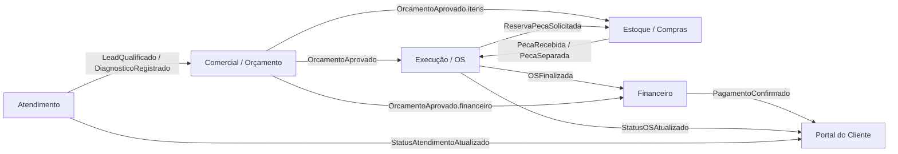

# Mapeamento de Contextos e Contratos de Integração

## 1) Diagrama de Contexto (alto nível)

> Convenção: cada contexto é dono dos seus dados transacionais e publica eventos de negócio para consumidores.

---

## 2) Entidades proprietárias por contexto

| Contexto | Entidades proprietárias (aggregate roots) | Papel que pode criar | Papel que pode editar | Observações de governança |
|---|---|---|---|---|
| Atendimento | `Cliente`, `Veiculo`, `Atendimento`, `DiagnosticoInicial`, `AnexoAtendimento` | Atendente | Atendente, Supervisor de atendimento | Comercial e Execução apenas referenciam IDs e snapshot mínimo do cliente/veículo. |
| Comercial / Orçamento | `Orcamento`, `ItemOrcamento`, `CondicaoComercial`, `ValidadeOrcamento`, `AprovacaoOrcamento` | Consultor comercial | Consultor comercial, Gestor comercial | Após aprovação, orçamento fica bloqueado para edição estrutural (itens/valores). |
| Execução / OS | `OrdemServico`, `EtapaOS`, `ApontamentoTecnico`, `ChecklistExecucao`, `ConsumoPecaOS` | Planejador/Coordenador técnico | Técnico responsável, Coordenador técnico | Não altera preço de venda; só executa escopo aprovado. |
| Estoque / Compras | `Produto`, `SaldoEstoque`, `MovimentoEstoque`, `PedidoCompra`, `Recebimento` | Almoxarife / Comprador | Almoxarife, Comprador, Gestor de suprimentos | Quantidades físicas e custo médio são exclusivos deste contexto. |
| Financeiro | `TituloReceber`, `TituloPagar`, `Fatura`, `Pagamento`, `BaixaFinanceira` | Financeiro | Financeiro, Controller | Status de liquidação e conciliação são fontes oficiais para portal e comercial. |
| Portal do Cliente | `ContaPortal`, `PreferenciaNotificacao`, `VisualizacaoDocumento`, `AceiteDigital` | Cliente (self-service) / Suporte portal | Cliente (dados de perfil), Suporte portal | Portal não é dono de orçamento/OS/fatura; atua como projeção de leitura + interações de aceite. |

---

## 3) Eventos de integração entre contextos

| Evento (domínio) | Publicador (owner) | Consumidores | Gatilho | Payload mínimo (contrato) |
|---|---|---|---|---|
| `LeadQualificado` | Atendimento | Comercial | Atendimento classificado como oportunidade | `atendimentoId`, `clienteId`, `veiculoId`, `sintomaResumo`, `prioridade`, `timestamp` |
| `DiagnosticoRegistrado` | Atendimento | Comercial, Execução | Diagnóstico inicial concluído | `atendimentoId`, `diagnosticoId`, `itensSugeridos[]`, `observacoes`, `timestamp` |
| `OrcamentoCriado` | Comercial | Portal, Atendimento | Primeira versão do orçamento gerada | `orcamentoId`, `atendimentoId`, `versao`, `valorTotal`, `validadeAte`, `timestamp` |
| `OrcamentoAprovado` | Comercial | Execução, Estoque/Compras, Financeiro, Portal | Aprovação do cliente | `orcamentoId`, `versaoAprovada`, `clienteId`, `veiculoId`, `itensAprovados[]`, `valorAprovado`, `condicaoPagamento`, `timestamp` |
| `OrcamentoReprovado` | Comercial | Atendimento, Portal | Reprovação pelo cliente | `orcamentoId`, `motivo`, `timestamp` |
| `OSGerada` | Execução | Portal, Financeiro, Estoque/Compras | Conversão de orçamento aprovado em OS | `osId`, `orcamentoId`, `dataPrevistaConclusao`, `responsavelTecnicoId`, `timestamp` |
| `ReservaPecaSolicitada` | Execução | Estoque/Compras | Necessidade de material para OS | `osId`, `itens[] {produtoId, quantidade}`, `prioridade`, `timestamp` |
| `PecaSeparada` | Estoque/Compras | Execução | Material reservado fisicamente | `reservaId`, `osId`, `itens[]`, `localizacao`, `timestamp` |
| `PecaRecebida` | Estoque/Compras | Execução, Financeiro | Recebimento de compra | `recebimentoId`, `pedidoCompraId`, `itens[]`, `valorRecebido`, `timestamp` |
| `OSIniciada` | Execução | Portal | Primeira etapa iniciada | `osId`, `dataInicio`, `timestamp` |
| `StatusOSAtualizado` | Execução | Portal, Atendimento | Mudança de etapa/status | `osId`, `statusAnterior`, `statusAtual`, `percentualConclusao`, `timestamp` |
| `OSFinalizada` | Execução | Financeiro, Portal, Atendimento | Encerramento técnico | `osId`, `dataFim`, `laudoFinal`, `itensExecutados[]`, `timestamp` |
| `FaturaEmitida` | Financeiro | Portal, Comercial | Geração de cobrança | `faturaId`, `osId|orcamentoId`, `valor`, `vencimento`, `linhaDigitavel`, `timestamp` |
| `PagamentoConfirmado` | Financeiro | Portal, Comercial, Atendimento | Liquidação confirmada | `pagamentoId`, `faturaId`, `valorPago`, `dataPagamento`, `timestamp` |

---

## 4) Campos somente leitura em módulos consumidores

### Atendimento (consome dados de outros)
- De `Comercial`: `orcamento.valorTotal`, `orcamento.status`, `orcamento.validadeAte`.
- De `Execução`: `os.status`, `os.previsaoConclusao`, `os.laudoFinal`.
- De `Financeiro`: `fatura.statusPagamento`, `fatura.valorEmAberto`.

### Comercial / Orçamento (consome)
- De `Atendimento`: `cliente.documento`, `veiculo.chassi`, `diagnosticoInicial`.
- De `Estoque`: `produto.saldoDisponivel`, `produto.custoMedio` (somente para sugestão de margem, sem alteração).
- De `Financeiro`: `limiteCreditoCliente`, `historicoInadimplencia`.

### Execução / OS (consome)
- De `Comercial`: `orcamento.itensAprovados`, `orcamento.precoVenda`, `orcamento.descontosAprovados`.
- De `Atendimento`: `sintomaRelatado`, `historicoAtendimento`.
- De `Estoque`: `saldoDisponivel`, `statusReserva`, `dataPrevistaReposicao`.

### Estoque / Compras (consome)
- De `Execução`: `os.prioridade`, `os.dataPrevistaConclusao`, `consumoPrevisto`.
- De `Comercial`: `demandaPrevista` derivada de orçamentos aprovados.

### Financeiro (consome)
- De `Comercial`: `orcamento.valorAprovado`, `condicaoPagamento`, `clienteResponsavelFinanceiro`.
- De `Execução`: `os.dataFinalizacao`, `itensExecutados`, `horasTecnicas`.

### Portal do Cliente (consome)
- De `Atendimento`: `protocoloAtendimento`, `statusAtendimento`.
- De `Comercial`: `orcamentoPdfUrl`, `statusAprovacao`, `validadeAte`.
- De `Execução`: `statusOS`, `etapaAtual`, `previsaoEntrega`.
- De `Financeiro`: `faturas[]`, `statusPagamento`, `comprovanteUrl`.

> Regra geral: módulo consumidor nunca atualiza campo mestre de outro contexto; qualquer alteração deve ocorrer via comando/API do contexto dono.

---

## 5) Matriz de responsabilidade por regra de negócio

| Regra de negócio | Contexto responsável (fonte da verdade) | Pode validar localmente? | Pode decidir/finalizar regra? | Anti-duplicidade (como evitar lógica repetida) |
|---|---|---|---|---|
| Elegibilidade de atendimento (dados mínimos para abrir caso) | Atendimento | Outros podem pré-validar UI | Somente Atendimento | Expor endpoint `POST /atendimentos/validacoes` reutilizável. |
| Cálculo de preço, desconto máximo e margem | Comercial | Execução pode exibir snapshot | Somente Comercial | Serviço de pricing central e versão de política comercial. |
| Conversão de orçamento aprovado em OS | Execução | Comercial só dispara evento | Somente Execução | Handler único para `OrcamentoAprovado`. |
| Reserva, baixa e reposição de estoque | Estoque/Compras | Execução valida disponibilidade | Somente Estoque/Compras | API única de movimentos (`/movimentos-estoque`). |
| Critério de finalização técnica da OS | Execução | Portal/Atendimento só consultam | Somente Execução | Máquina de estados da OS em um único domínio. |
| Emissão de título/fatura e cálculo de juros/multa | Financeiro | Comercial pode simular | Somente Financeiro | Motor financeiro central com tabela de encargos versionada. |
| Estado de pagamento (aberto, parcial, liquidado) | Financeiro | Portal exibe | Somente Financeiro | Consumidores leem projeções/eventos de pagamento. |
| Publicação de status para cliente final | Portal (apresentação) + contexto origem (conteúdo) | Sim | Portal decide canal; origem decide conteúdo | Contrato de evento padrão `Status*Atualizado`. |

---

## 6) Tabela de contratos de API/Eventos (proposta)

| Tipo | Nome do contrato | Dono | Consumidor(es) | Operação/Canal | Campos obrigatórios | SLA/Consistência |
|---|---|---|---|---|---|---|
| API comando | `CriarAtendimento` | Atendimento | Front/Portal interno | `POST /atendimentos` | `clienteId`, `veiculoId`, `sintoma`, `canalOrigem` | Síncrono, resposta imediata |
| API consulta | `ConsultarOrcamento` | Comercial | Atendimento, Portal, Execução | `GET /orcamentos/{id}` | `id` | Síncrono, leitura autorizada |
| Evento | `OrcamentoAprovado.v1` | Comercial | Execução, Estoque, Financeiro, Portal | Broker (topic `comercial.orcamento-aprovado`) | `eventId`, `occurredAt`, `orcamentoId`, `versao`, `itensAprovados`, `valorAprovado` | Assíncrono, pelo menos uma vez, idempotência por `eventId` |
| API comando | `GerarOS` | Execução | Comercial (orquestração) | `POST /ordens-servico` | `orcamentoId`, `responsavelTecnicoId` | Síncrono + publica `OSGerada` |
| Evento | `OSGerada.v1` | Execução | Portal, Estoque, Financeiro | Broker (topic `execucao.os-gerada`) | `eventId`, `osId`, `orcamentoId`, `dataPrevistaConclusao` | Assíncrono, reprocessável |
| Evento | `PecaRecebida.v1` | Estoque/Compras | Execução, Financeiro | Broker (topic `estoque.peca-recebida`) | `eventId`, `recebimentoId`, `itens`, `valorRecebido` | Assíncrono, ordenação por `pedidoCompraId` |
| Evento | `OSFinalizada.v1` | Execução | Financeiro, Portal, Atendimento | Broker (topic `execucao.os-finalizada`) | `eventId`, `osId`, `dataFim`, `itensExecutados` | Assíncrono, gatilho para faturamento |
| API comando | `EmitirFatura` | Financeiro | Execução (trigger), Backoffice | `POST /faturas` | `referenciaTipo`, `referenciaId`, `valor`, `vencimento` | Síncrono |
| Evento | `PagamentoConfirmado.v1` | Financeiro | Portal, Comercial, Atendimento | Broker (topic `financeiro.pagamento-confirmado`) | `eventId`, `faturaId`, `valorPago`, `dataPagamento` | Assíncrono, eventual consistency |

### Campos transversais obrigatórios em eventos
- `eventId` (UUID), `eventType`, `eventVersion`, `occurredAt` (UTC ISO-8601), `producer`, `correlationId`, `tenantId` (quando multiempresa).

### Diretriz de evolução de contratos
- Quebra de contrato: publicar nova versão (`*.v2`) sem remover `v1` até migração completa.
- Campos novos: sempre opcionais por default na mesma versão.
- Consumidores devem ser tolerantes a campos desconhecidos.
